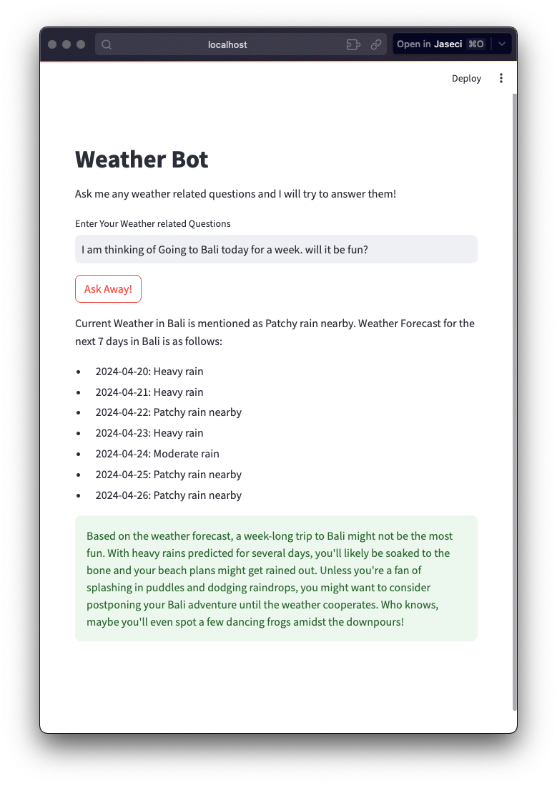

# Weather App

Simple Weather App that checks the weather based on the question you ask and asnwers with hint of comedy.



## Prerequisites

Before running the application, make sure you have the following:

- A Weather API key: Get your API key from [Weather API](https://www.weatherapi.com/)
- An Anthropics API key: Create an account and get your API key from [Anthropics](https://www.anthropics.com/)

## Installation

1. Clone this repository to your local machine:

    ```shell
    git clone https://github.com/chandralegend/jac-examples.git
    ```

2. Navigate to the project directory:

    ```shell
    cd weather-app
    ```

3. Install the dependencies using `requirements.txt`:

    ```shell
    pip install -r requirements.txt
    ```

## Configuration

1. Create a `.env` file in the project directory, similar to the `.env.sample` file.

2. Fill in the API keys obtained from Weather API and Anthropics in the `.env` file.

3. Apply the environment variables by running the following command:

    ```shell
    source .env
    ```

## Usage

To run the application, use the following commands:

- To retrieve weather data:

  ```shell
  jac run weather.jac
  ```

- To run the user interface:

  ```shell
  streamlit run app.py
  ```

That's it! You should now be able to retrieve weather data and interact with the application.

For any issues or questions, please open an [issue](https://github.com/chandralegend/jac-examples/issues) on GitHub.